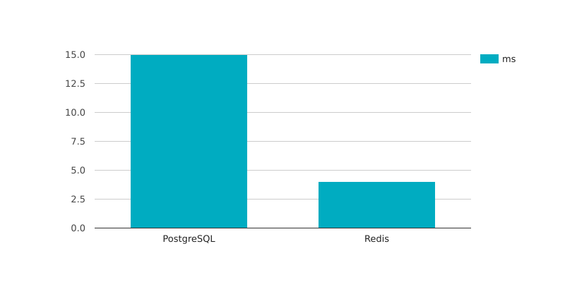
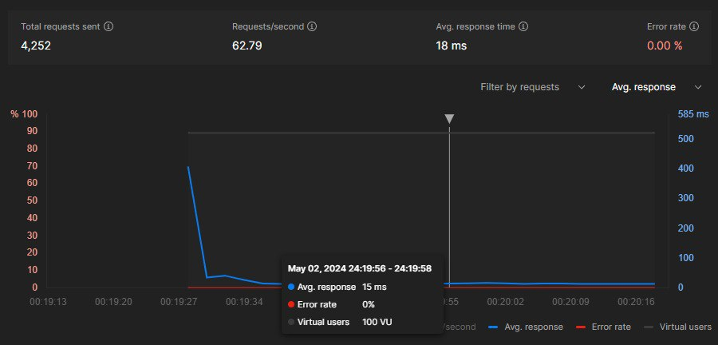
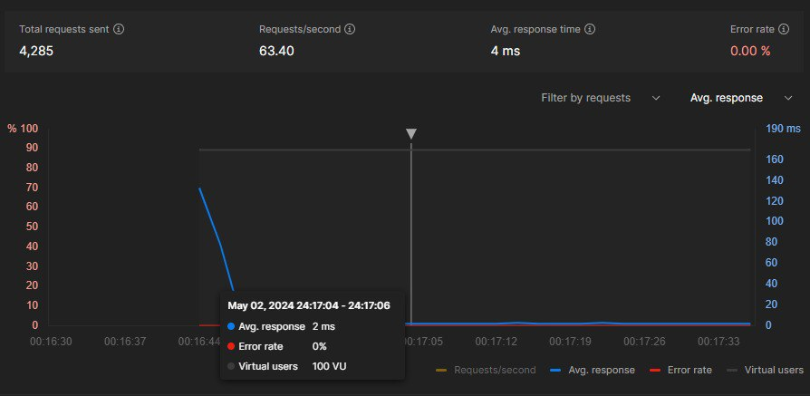
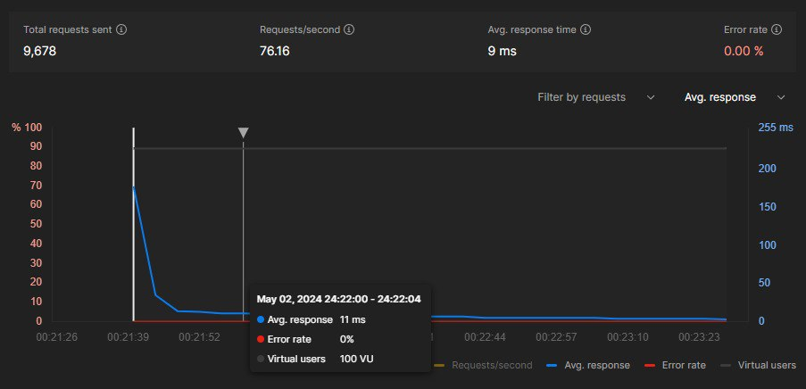
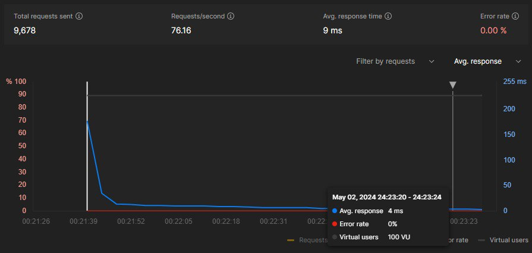

# Optimization with Redis
This project aims to demonstrate optimization capabilities using Redis. The project uses Java Spring and the PostgreSQL database and as a Redis cache.  
  
  
### Results optimization ms
Java: 21  
Service: Java Spring  
Database: PostgreSQL ~15 ms  
Cache: Redis ~4 ms  
  
### Without a cache. PostgreSQL queries

  
Requests/second: 62.79  
Avg. response: 15 ms

### With a cache. Redis queries

  
Requests/second: 63.40  
Avg. response: 4 ms

### Warming up the cache with Redis


  
  
Time warming up cache: 2 min  
Count users: 100  
Requests/second: 76.16  
The request time has been lowered: from 15 to 4 ms

### How to Install

Run databases from docker-compose file:  
`docker-compose up -d --build`  
  
Build project with command:  
`.\gradlew build`  

Run `jar` file:  
`java -jar name.jar`
  
The collected files are stored in build/libs.

#### ENV file

**Location**: src/main/resources  

````env
POSTGRESQL_DRIVER=org.postgresql.Driver
POSTGRESQL_URL=jdbc:postgresql://localhost:5432/postgres
POSTGRESQL_USERNAME=admin
POSTGRESQL_PASSWORD=root

REDIS_HOST=localhost
REDIS_PORT=6379
REDIS_USER=default
REDIS_PASSWORD=your_password
````

### How to switch cache system
**Location**: src/main/resources  

**application.properties:**  

Use the cache: `spring.cache.type=redis`  
Don't use the cache: `spring.cache.type=none`

### API

**[POST] Create news:**

Link: `http://localhost:8080/api/v1/news/create`  
Body:
```json
{
    "title": "This is title",
    "content": "This is content"
}
```
Response:
```json
{
  "id": 4218,
  "title": "This is title",
  "content": "This is content",
  "rating": 0
}
```
  
**[GET] Get random news:**  

Link: `http://localhost:8080/api/v1/news/random`  
Response:
```json
{
    "id": 1525,
    "title": "This is title 1525",
    "content": "This is content 1525",
    "rating": 0
}
```
  
**[DELETE] Remove news by id:**  
  
Link: `http://localhost:8080/api/v1/news/delete`  
Body:
```json
{
    "id": 4217
}
```
Response:
```json
{
    "id": 4217,
    "title": null,
    "content": null,
    "rating": null
}
```